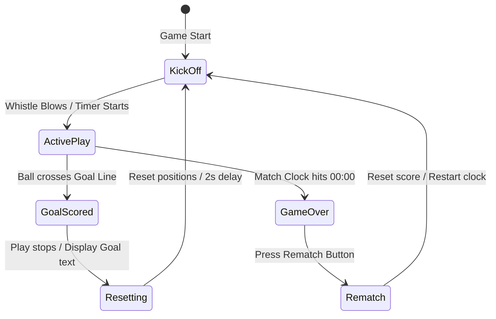
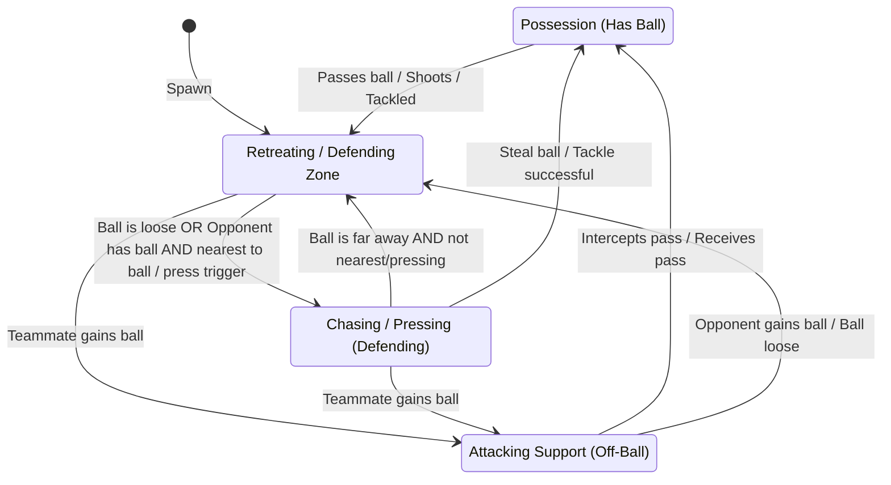

# 🏆 LAB02 Workbook: Building a Multi-Agent Football Simulation

Welcome to **LAB02 (Multi-Agent Systems)**! In this lab, you will transition from single-agent calls to building a **distributed, hierarchical multi-agent system** that communicates over network boundaries, collaborates to execute tactics, and uses advanced protocols to report its own state.

By the end of this lab, you will have built a team of specialized player agents coordinated by a Team Captain, communicating via the **Agent-to-Agent (A2A)** protocol, and using the **Model Context Protocol (MCP)** to autonomously request substitutions when tired.

---

## 🏗️ Target Architecture & Flow

Here is the complete multi-agent architecture you will build step-by-step:

```mermaid
sequenceDiagram
    autonumber
    actor Coach as User (Coach)
    participant UI as Frontend UI (Vite)
    participant Game as Phaser Game Engine
    participant CoachA as Coach Agent (adk web :8000)
    participant Cap as Team Captain (A2A :8001)
    participant Players as Player Agents (Def/Mid/Fwd/GK)
    participant MCP as Football MCP Server
    participant Profiles as JSON state (player_state/*.json, substitutions.json)

    Coach->>UI: Type instruction (e.g., "Everyone attack!") & click Shout
    UI->>UI: Render Coach shout bubble above portrait
    UI->>CoachA: POST /run_sse with instruction + fitness report

    rect rgb(20, 30, 50)
        note right of CoachA: [Task 3] Coach relays over A2A
        CoachA->>Cap: A2A: forward directive + condition notes
        note right of Cap: [Task 4] Captain delegates to specialists
        Cap->>Players: Delegate via AgentTool to each player
        note right of Players: [Task 4] Players update physics on disk
        Players->>Profiles: Call `update_profile` to write new stats
        note right of Players: [Task 5] Players self-report via MCP
        Players->>MCP: If too tired/hurt: report_injury / request_substitution
        MCP->>Profiles: Write substitutions.json
        Cap-->>CoachA: Huddle JSON (player affirmations)
        CoachA-->>UI: Stream SSE with huddle JSON
    end

    UI->>Game: Trigger `scene.showTeamHuddle(huddleData)`
    loop Game loop (Every 2 seconds)
        UI->>Profiles: Poll profile JSONs + substitutions.json
        Profiles-->>UI: Updated attributes / condition events
        UI->>Game: Apply new attributes toast injuries sub requests top-right
    end
```



---

## ⚙️ Local Setup & Running Instructions

### 1. Setup your Environment
1.  Navigate to the `LAB02` directory:
    ```bash
    cd repo/agent-football/LAB02
    ```
2.  Activate your virtual environment:
    ```bash
    source ../venv/bin/activate
    ```
3.  Ensure your `.env` file is configured at the root of `agent-football` (or copy it here) with your API key:
    ```env
    GEMINI_API_KEY=your_actual_gemini_api_key_here
    ```

### 2. Running the Frontend
1.  Open a new terminal and navigate to the `frontend` directory:
    ```bash
    cd repo/agent-football/frontend
    ```
2.  Start the Vite development server:
    ```bash
    npm run dev
    ```
    *The UI will run on `http://localhost:5173/`.*

---

## 🎮 The 5-Step Developer Journey

We have broken the development into 5 progressive tasks. You will start with a simple local monolith and gradually build up the complete hierarchical network.

> [!NOTE]
> If you get stuck at any step, you can find the complete, working reference solutions in the original files (e.g., **`agent.py`**, **`captain.py`**, **`captain_server.py`**) alongside your templates!

---

### 🔵 Task 1: The Local Monolith (Single Agent in `adk web`)
*   **Objective**: Bootstrap your very first local agent using `adk web` and verify your Gemini connection.
*   **File to Edit**: [football_agents/task_agent.py](file:///usr/local/google/home/piyasharma/Documents/Sourcecode/code-the-coach/repo/agent-football/LAB02/football_agents/task_agent.py)

#### 📝 Instructions:
1.  Open [task_agent.py](file:///usr/local/google/home/piyasharma/Documents/Sourcecode/code-the-coach/repo/agent-football/LAB02/football_agents/task_agent.py).
2.  Review the `coach_agent` (`LlmAgent`) definition. It has been pre-configured to handle the system commands `BACKUP_BASELINE` and `RESTORE_BASELINE` (which automatically snapshot your LAB01 sliders to disk).
3.  Your task is to write the instruction prompt for the `TACTICAL SHOUTS` section. Instruct the Coach to respond **directly** to any other message (shouts like "everyone attack") as a passionate, encouraging coach with a funny 1-sentence shout. Do NOT add any sub-agents or tools yet.

#### 🚀 Verification:
1.  Start the Coach server using your task file:
    ```bash
    cd repo/agent-football/LAB02
    ../venv/bin/adk web task_agent.py
    ```
    *(Serves on `http://localhost:8000`).*
2.  Open `http://localhost:5173/` in your browser, click **Kick Off**.
3.  Type `everyone attack` in the shout bar and click **Shout!**.
4.  Verify in the **retro terminal** on the right that:
    *   The Coach receives the shout.
    *   The Coach responds directly (e.g. `💬 ManagerAgent: "Alright lads, let's get stuck in! Attack!"`).
    *   *No player speech bubbles appear yet, as they are not connected.*

---

### 🔌 Task 2: Create the Standalone Captain A2A Server
*   **Objective**: Expose an agent as an independent, network-reachable service using the **Agent-to-Agent (A2A)** protocol.
*   **Files to Edit**: 
    1.  [football_agents/task_captain.py](file:///usr/local/google/home/piyasharma/Documents/Sourcecode/code-the-coach/repo/agent-football/LAB02/football_agents/task_captain.py)
    2.  [football_agents/task_captain_server.py](file:///usr/local/google/home/piyasharma/Documents/Sourcecode/code-the-coach/repo/agent-football/LAB02/football_agents/task_captain_server.py)

#### 📝 Instructions:
1.  Open [task_captain.py](file:///usr/local/google/home/piyasharma/Documents/Sourcecode/code-the-coach/repo/agent-football/LAB02/football_agents/task_captain.py). Initialize the `captain_agent` as a simple `LlmAgent`. Give it a prompt instructing it to act as the team captain and respond with a simple player-style greeting (e.g., "Captain here, ready to lead!"). Leave `tools` empty.
2.  Open [task_captain_server.py](file:///usr/local/google/home/piyasharma/Documents/Sourcecode/code-the-coach/repo/agent-football/LAB02/football_agents/task_captain_server.py). Write the A2A server plumbing:
    *   Import `to_a2a` from `google.adk.a2a.utils.agent_to_a2a`.
    *   Import `uvicorn` and your `captain_agent` (from `football_agents.task_captain`).
    *   Convert the `captain_agent` into a Starlette app: `app = to_a2a(captain_agent, host=HOST, port=PORT)`.
    *   In the `__main__` block, call `uvicorn.run(app, host=HOST, port=PORT)`.

#### 🚀 Verification:
1.  Start your new Captain task server in a new terminal:
    ```bash
    cd repo/agent-football/LAB02
    ../venv/bin/python3 -m football_agents.task_captain_server
    ```
    *(Serves on `http://localhost:8001`).*
2.  Verify the server is publishing its **Agent Card** by visiting:
    `http://localhost:8001/.well-known/agent-card.json` in your browser. You should see a JSON description of your Captain agent!

---

### 🌉 Task 3: Bridge the Coach and Captain (A2A Network Hop)
*   **Objective**: Connect your local Coach (`task_agent.py`) to the remote Captain (`task_captain_server.py`) over the A2A protocol.
*   **File to Edit**: [football_agents/task_agent.py](file:///usr/local/google/home/piyasharma/Documents/Sourcecode/code-the-coach/repo/agent-football/LAB02/football_agents/task_agent.py)

#### 📝 Instructions:
1.  Open [task_agent.py](file:///usr/local/google/home/piyasharma/Documents/Sourcecode/code-the-coach/repo/agent-football/LAB02/football_agents/task_agent.py).
2.  Import `RemoteA2aAgent` and `AGENT_CARD_WELL_KNOWN_PATH` from `google.adk.agents.remote_a2a_agent`.
3.  Define `team_captain_remote` using `RemoteA2aAgent`, passing it the Captain's A2A URL (`CAPTAIN_A2A_URL`).
4.  Update the Coach (`coach_agent`) configuration:
    *   Add `team_captain_remote` to the `sub_agents` list.
    *   Rewrite the `instruction` prompt: Instruct the Coach that for any tactical shout, it **must immediately transfer control** to the `team_captain` sub-agent. It must NOT answer the shout itself.

#### 🚀 Verification:
1.  Ensure both servers are running:
    *   Terminal 1: `python -m football_agents.task_captain_server` (port 8001)
    *   Terminal 2: `adk web task_agent.py` (port 8000)
2.  Refresh your browser and shout `everyone attack`.
3.  Observe the **Live Agent Terminal** on the screen! You should see:
    *   `📣 Coach: "everyone attack"`
    *   `📣 Coach: "Relaying instruction to Team Captain over A2A (port 8001)..."`
    *   `🔗 Coach: Relayed to Team Captain over A2A!`
    *   `💬 TeamCaptain: "Captain here, ready to lead!"` (relayed across the network!)

---

### 🛡️ Task 4: Specialists, Orchestration & Environmental Control (End-to-End)
*   **Objective**: Implement multi-agent delegation, prompt-based attribute mapping, and environmental tool-use to control the Phaser game.
*   **Files to Edit**:
    1.  [football_agents/specialist_agents/task_defender.py](file:///usr/local/google/home/piyasharma/Documents/Sourcecode/code-the-coach/repo/agent-football/LAB02/football_agents/specialist_agents/task_defender.py) (and other task specialists: `task_midfielder.py`, `task_forward.py`, `task_goalkeeper.py`).
    2.  [football_agents/task_captain.py](file:///usr/local/google/home/piyasharma/Documents/Sourcecode/code-the-coach/repo/agent-football/LAB02/football_agents/task_captain.py)

#### 📝 Instructions:
1.  **Define the Specialists**: Open `task_defender.py`.
    *   Initialize `defender_agent` as an `LlmAgent`.
    *   Equip it with the `update_profile` tool (imported from `.tools`).
    *   Write a prompt instructing the Defender to:
        *   Determine if the Captain's instruction is relevant to them.
        *   If relevant, map qualitative commands (e.g. "park the bus") to **multiple** precise physics attributes (e.g., `defensePositioning`, `aggression`, `speed`) and call `update_profile`.
        *   Return a quirky 3-5 word verbal response.
    *   *Repeat this for `task_midfielder.py`, `task_forward.py`, and `task_goalkeeper.py` (refer to the attribute list in their files).*
2.  **Orchestrate the Captain**: Open `task_captain.py`.
    *   Uncomment the imports pointing to your task specialists (`task_defender`, etc.).
    *   Equip the Captain by adding the four task specialists to its `tools` list, wrapped in `AgentTool(agent)` (e.g., `AgentTool(defender_agent)`).
    *   Rewrite the Captain's prompt:
        *   Instruct it to delegate shouts to relevant players by calling their tools.
        *   Instruct it to gather their verbal responses and output **ONLY** a valid JSON object matching the huddle schema:
            `{ "status": "...", "huddle": { "defender": "...", "midfielder": "...", ... } }`
        *   Enforce strict JSON format (no markdown, no backticks).

#### 🚀 Verification:
1.  Restart both servers:
    *   Terminal 1: `python -m football_agents.task_captain_server`
    *   Terminal 2: `adk web task_agent.py`
2.  Refresh the browser, type `everyone attack`, and click Shout.
3.  Observe the terminal trace and game:
    *   The Captain delegates to all 4 players: `🎛️ Captain: Delegating to DEFENDER...`
    *   Each player calls their tool: `🛡️ DefenderSpecialist: Calling update_profile tool ➔ {"attackPositioning":0.75...}`
    *   The huddle speech bubbles appear above the players on the pitch!
    *   Open the **Debug Logs** panel at the bottom: verify the physics parameters of the players have actually changed on disk!

---

### ⚠️ Task 5: Autonomous MCP Self-Reporting (Added Bonus)
*   **Objective**: Connect agents to external tool servers using the **Model Context Protocol (MCP)** to enable autonomous status reporting.
*   **Files to Edit**: [football_agents/specialist_agents/task_defender.py](file:///usr/local/google/home/piyasharma/Documents/Sourcecode/code-the-coach/repo/agent-football/LAB02/football_agents/specialist_agents/task_defender.py) (and other task specialists).

#### 📝 Instructions:
1.  Open `task_defender.py`.
2.  Uncomment the imports: `from .tools import make_condition_toolset, CONDITION_GUIDANCE`.
3.  Add `make_condition_toolset()` to the agent's `tools` list.
4.  Append `+ CONDITION_GUIDANCE` to your prompt's instruction string.
5.  *Repeat this for the other task specialists.*
6.  *(Behind the scenes, `make_condition_toolset()` connects to our standalone FastMCP server `football_mcp_server.py` over stdio and exposes the `report_injury` and `request_substitution` tools to the players).*

#### 🚀 Verification:
1.  Restart your task Captain server and `adk web task_agent.py`.
2.  Refresh the browser and start playing.
3.  Every 30 seconds, the frontend automatically appends a **"Fitness Report"** to your background status checks, telling the Captain if any players are tired.
4.  Wait for a player's stamina to drop.
5.  Verify that the player agent **autonomously decides** to call the MCP tool:
    *   `⚠️ DefenderSpecialist (MCP): Requested substitution! Reason: "tired"`
6.  Observe the top-right of the screen: a beautiful retro **toast notification** will slide in, announcing the substitution request to the Coach!

---

## 📊 Reference: Player Attributes & Gameplay Effects

When player agents call the `update_profile` tool, they modify specific parameters in the JSON profile state files. The Phaser engine polls these files every 2 seconds and applies them, directly altering gameplay:

| Role | Key Attributes | Gameplay Effect |
| :--- | :--- | :--- |
| **Defender** | `defensePositioning`<br>`attackPositioning`<br>`tackleRadius`<br>`aggression` | **Aggression:** High values make the defender sprint faster to challenge the ball.<br>**Tackle Radius:** Larger values allow the defender to steal the ball from further away.<br>**Positioning:** Adjusts how deep the defender stays on the pitch. |
| **Midfielder** | `supportRunFrequency`<br>`passProbability`<br>`attackPositioning` | **Support Run:** Higher frequency triggers midfielders to make forward runs into space.<br>**Pass Probability:** Higher values favor passing over shooting. |
| **Forward** | `attackPositioning`<br>`pressingIntensity`<br>`shotPower` | **Pressing Intensity:** High values make the forward actively chase down opposing defenders.<br>**Shot Power:** Boosts ball velocity when shooting. |
| **Goalkeeper** | `attackPositioning`<br>`diveChance`<br>`trackingSpeed` | **Attack Positioning (Sweeper):** High values allow the goalie to leave the box to clear long balls.<br>**Dive Chance:** Tendency to leap and dive at shots. |

---

## 🤖 Game & Player Finite State Machines (FSM)

### 1. Overall Gameplay FSM
The gameplay progresses through several global states managed by `game.js`:



---

### 2. Outfield Player AI FSM
Outfield players (Defenders, Midfielders, Forwards) switch states based on team possession and proximity to the ball:



---

### 3. Goalkeeper FSM
The goalkeeper's AI net protection logic:


