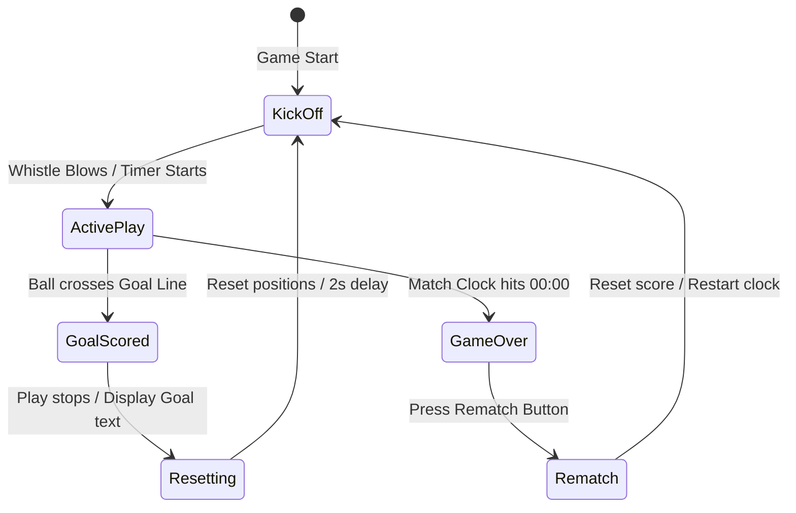
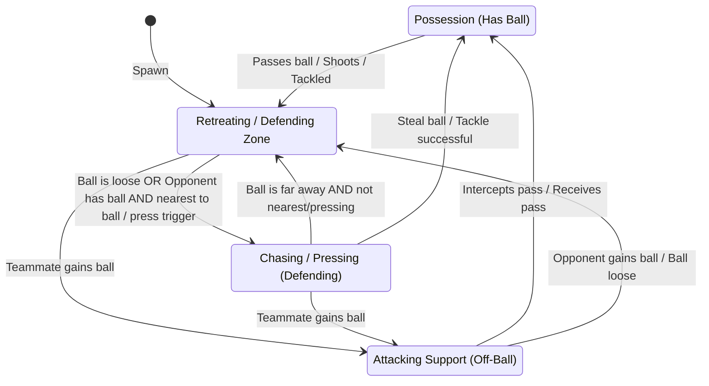
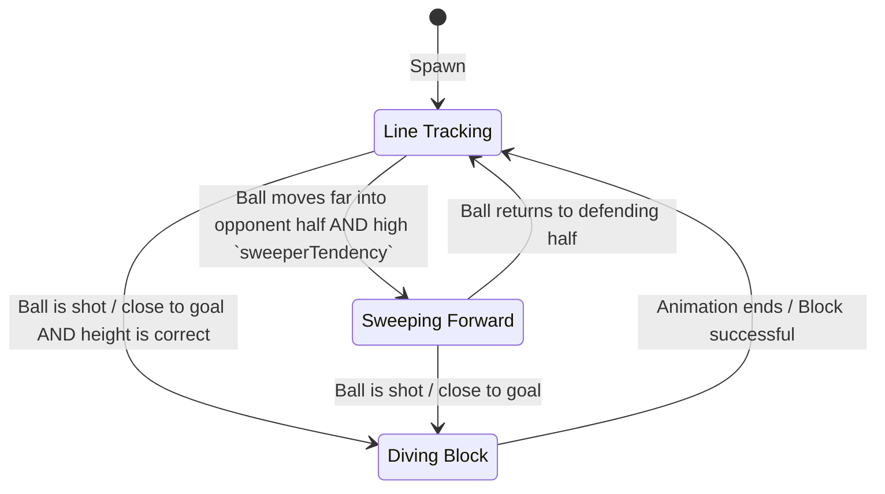

# Worldcup Mania: Gemini-Powered Agentic Football

An interactive, real-time 5v5 soccer simulation game powered by the Google Agentic Development Kit (ADK) and Gemini. Users take the role of the Coach/Manager, using natural language to shout instructions to the team. The instruction flows through a small **agent hierarchy** — the **Coach** relays it over the **A2A protocol** to a **Team Captain**, who delegates to the individual **player agents**. Players parse the instructions, dynamically update their playstyles (affecting physics and AI logic), and shout back quirky affirmations sequentially in real-time.

Players can also report on their own condition: each player agent has an **MCP tool** to **report an injury** or **request a substitution** when too tired. These surface as notification toasts in the top-right of the screen (notification-only for now — no roster change).

### Protocols at a glance
- **A2A (Agent-to-Agent):** the Coach agent (served by `adk web`) reaches the Team Captain, which runs as a standalone A2A service (`football_agents/captain_server.py`, port `8001`), via `RemoteA2aAgent`.
- **MCP (Model Context Protocol):** the player agents connect (over stdio) to `football_agents/football_mcp_server.py`, which exposes `report_injury` and `request_substitution`. Calls are written to `frontend/public/player_state/substitutions.json`, which the frontend polls.

---

## 🏗️ System Architecture & Interaction Flow

The application consists of a **Phaser 3 Frontend** (HTML/JS/Vite) and an **ADK Python Agent Backend** (running on FastAPI).

```mermaid
sequenceDiagram
    autonumber
    actor Coach as User (Coach)
    participant UI as Frontend UI
    participant Game as Phaser Game Engine
    participant CoachA as Coach Agent (adk web :8000)
    participant Cap as Team Captain (A2A :8001)
    participant Players as Player Agents (Def/Mid/Fwd/GK)
    participant MCP as Football MCP Server
    participant Profiles as JSON state (player_state/*.json, substitutions.json)

    Coach->>UI: Type instruction (e.g., "Everyone attack!") & click Shout
    UI->>UI: Render Coach shout bubble above coach portrait
    UI->>CoachA: POST /run_sse with instruction + fitness report

    rect rgb(20, 30, 50)
        note right of CoachA: Coach relays over A2A
        CoachA->>Cap: A2A: forward directive + condition notes
        Cap->>Players: Delegate via AgentTool to each relevant player
        Players->>Profiles: Call `update_profile` to write new stats
        Players->>MCP: If too tired/hurt: report_injury / request_substitution
        MCP->>Profiles: Write substitutions.json
        Cap-->>CoachA: Huddle JSON (player affirmations)
        CoachA-->>UI: Stream SSE with huddle JSON
    end

    UI->>Game: Trigger `scene.showTeamHuddle(huddleData)`
    loop Game loop (Every 2 seconds)
        UI->>Profiles: Poll profile JSONs + substitutions.json
        Profiles-->>UI: Updated attributes / condition events
        UI->>Game: Apply new attributes; toast injuries/sub requests (top-right)
    end
```

### 1. The Frontend UI & Phaser Game Engine
- **Phaser 3 Game Canvas:** Renders the pitch, players, goals, and soccer ball. Handles game loops, player AI, collision detection, and score tracking.
- **Coach Input Bar:** Standardized input box at the bottom of the screen to send custom coach shouts to the backend.
- **Floating Speech Bubbles:** Programmatically drawn vector graphics attached to the player and coach sprites, following them dynamically in real-time.

### 2. The ADK Python Backend
- **Coach agent (`root_agent`, served by `adk web`):** the entrypoint the frontend talks to via `/run_sse`. It relays the coach's shout to the Team Captain over **A2A** and returns the captain's huddle JSON unchanged.
- **Team Captain (`captain_server.py`, A2A service on `:8001`):** receives the directive and *delegates* to the player agents (each wired in as an `AgentTool`), then synthesises the final huddle JSON.
- **Specialized player agents:** dedicated agents for the `Defender`, `Midfielder`, `Forward`, and `Goalkeeper` roles. Each determines whether the captain's relayed instruction is relevant to them.
- **The `update_profile` Tool:** If relevant, the player agent calls `update_profile` to modify specific parameters (e.g. `defensePositioning`, `aggression`, `attackPositioning`) in the JSON profile state files.
- **MCP condition tools:** each player agent also connects to the Football MCP server and can call `report_injury` / `request_substitution` based on the fitness note relayed by the captain.
- **Quirky Affirmations:** Each agent is instructed to respond with a quirky, football-style affirmation (strictly 3-5 words long), streamed back to the frontend via SSE (`Server-Sent Events`).

---

## ⚙️ Local Setup & Running Instructions

### Prerequisites
- Python 3.10+
- Node.js (with npm)
- Gemini API Key

---

### 1. Running the Backend Agent
1. Navigate to the project root directory:
   ```bash
   cd agent-football
   ```
2. Create or update your `.env` file in the root directory:
   ```env
   GEMINI_API_KEY=your_actual_gemini_api_key_here
   ```
3. Create and activate a Python virtual environment:
   ```bash
   python3 -m venv venv
   source venv/bin/activate
   ```
4. Install the backend dependencies:
   ```bash
   pip install -r football_agents/requirements.txt
   ```
5. Start the **Team Captain A2A service** (in its own terminal, with the venv active). It must be up
   *before* `adk web` so the Coach agent can resolve the captain's agent card:
   ```bash
   python football_agents/captain_server.py
   ```
   *Serves on `http://localhost:8001`; the agent card is at `http://localhost:8001/.well-known/agent-card.json`.*
6. Start the ADK web server (the **Coach** entrypoint) in another terminal:
   ```bash
   adk web
   ```
   *The server will boot up and run on `http://127.0.0.1:8000`.*

> **Three processes total:** (1) the Captain A2A service on `:8001`, (2) `adk web` (Coach) on `:8000`,
> and (3) the Vite frontend (below). The Captain spawns the MCP server (`football_mcp_server.py`)
> on demand over stdio — you do not start it yourself.

---

### 2. Running the Frontend
1. Open a new terminal session and navigate to the `frontend` directory:
   ```bash
   cd agent-football/frontend
   ```
2. Install npm dependencies (if running for the first time):
   ```bash
   npm install
   ```
3. Build the production assets:
   ```bash
   npm run build
   ```
4. Start the Vite local development server:
   ```bash
   npm run dev
   ```
   *The client application will run on `http://localhost:5173/`.*

---

## 📊 Player Profiles & Gameplay Effects

When an agent calls the `update_profile` tool, the changes are written directly to the following files in the frontend public directory:
- [defender.json](frontend/public/player_state/defender.json)
- [midfielder.json](frontend/public/player_state/midfielder.json)
- [forward.json](frontend/public/player_state/forward.json)
- [goalkeeper.json](frontend/public/player_state/goalkeeper.json)

The frontend automatically polls these files to modify variables inside the physics loop, directly altering gameplay dynamics:

| Role | Affected Attributes | Gameplay Effect |
| :--- | :--- | :--- |
| **Defender** | `defensePositioning`<br>`attackPositioning`<br>`tackleRadius`<br>`aggression` | **Aggression:** High values make the defender sprint faster when challenging for the ball.<br>**Tackle Radius:** Larger values allow the defender to steal the ball from further away.<br>**Positioning:** Adjusts how deep the defender stays on the pitch. |
| **Midfielder** | `supportRunFrequency`<br>`passAccuracy`<br>`attackPositioning` | **Support Run:** Higher frequency triggers midfielders to make forward runs into space.<br>**Attack Positioning:** Moves midfielders closer to the opponent's box for shots. |
| **Forward** | `attackPositioning`<br>`defensiveWorkRate`<br>`pressingIntensity` | **Pressing Intensity:** High values make the forward actively chase down opposing defenders.<br>**Defensive Work Rate:** Determines if the forward tracks back during counterattacks. |
| **Goalkeeper** | `sweeperTendency`<br>`stayOnLine`<br>`aggression` | **Sweeper Tendency:** High sweep tendency allows the goalkeeper to leave the penalty box to clear long balls.<br>**Stay On Line:** High stay on line forces the goalie to stay inside the goalposts to cover shots. |

---

## 🤖 Game & Player Finite State Machines (FSM)

### 1. Overall Gameplay FSM
The gameplay progresses through several global states managed by `game.js`:



---

### 2. Outfield Player AI FSM
Outfield players (Defenders, Midfielders, Forwards) switch states based on team possession and proximity to the ball:



#### Detailed Outfield State Logic:
*   **Possession (Has Ball):** Runs towards the opponent's goal. After a `decisionDelay` (e.g. `100ms`), evaluates whether to shoot (if in `shotRange`), pass to a teammate (based on `passProbability` and `passRiskTolerance`), or continue dribbling.
*   **Attacking Support:** Positions forward to support the ball possessor based on `attackPositioning` and `supportRunFrequency`, moving wide or narrow based on `widthPreference`.
*   **Chasing/Pressing:** Sprints directly towards the ball. If within `tackleRadius` of an opponent possessing the ball, initiates a slide tackle (cooldown and foul risk applied).
*   **Retreating:** Returns back to zone coordinates, blending default positioning coordinates with ball coordinates using `formationDiscipline` and `defensePositioning`.

---

### 3. Goalkeeper FSM
The goalkeeper's AI uses a specialized state machine to protect the net:



#### Detailed Goalkeeper State Logic:
*   **Line Tracking:** Moves laterally along the goal line (Y range: 280 to 480) matching the ball's Y position to stay centered.
*   **Sweeping Forward:** Moves forward on the X-axis out of the box when the ball is far away, clearing long balls (scaled by `sweeperTendency` and `attackPositioning`).
*   **Diving Block:** Triggers a fast leaping dive if the ball comes inside the box and is offset from the goalkeeper's Y position (trigger rate scaled by `diveChance`).

