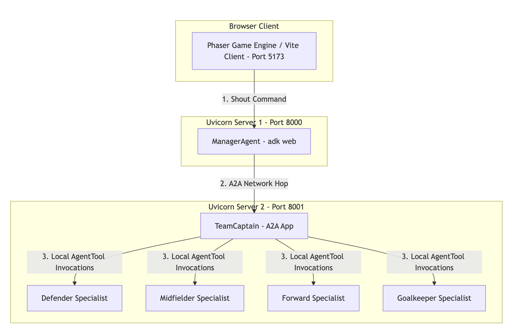
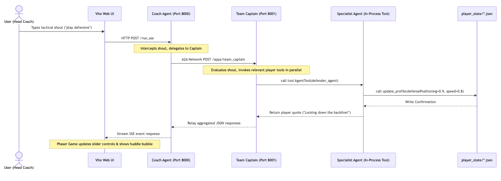
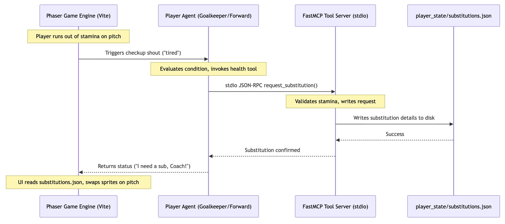
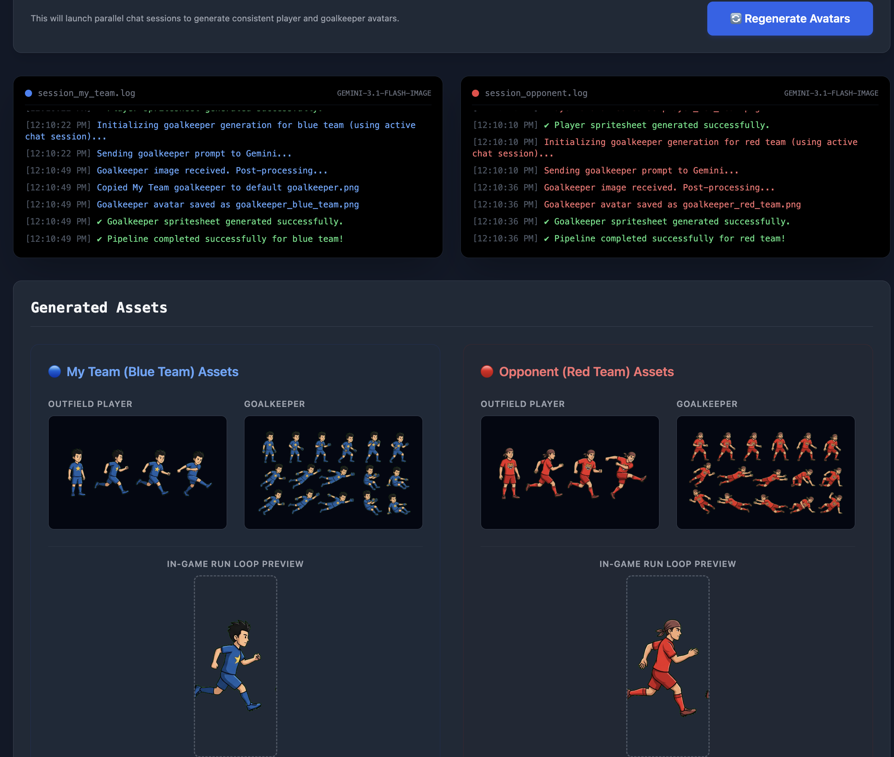
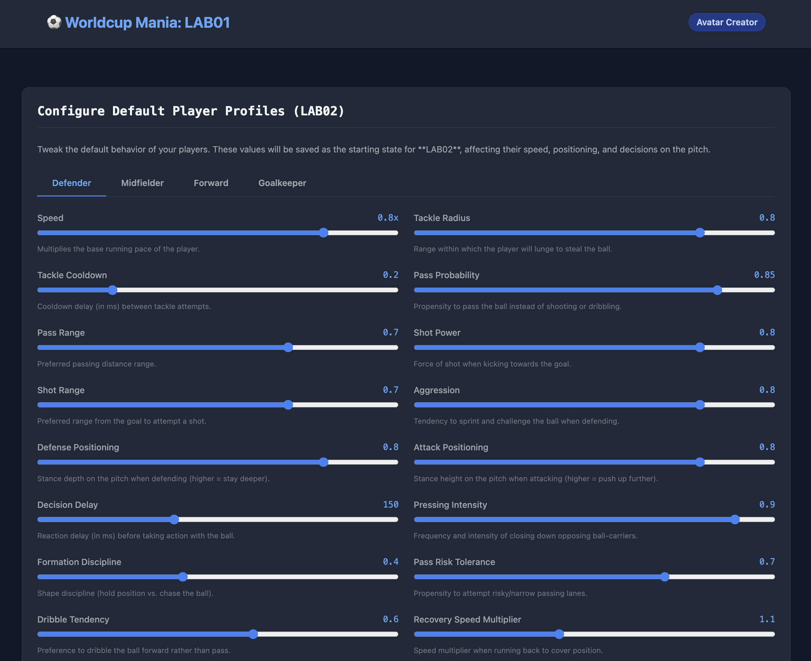

# Multi-Agent Football Worldcup Mania


## 1. Overview & Core Concepts

In this hands-on lab, you will learn to build and orchestrate a Gemini-powered multi-agent system using the Google Agent Development Kit (ADK) through a 5v5 football simulation. The core objective is to explore single-agent configuration (Lab 1) and master multi-agent orchestration patterns (Lab 2) using Agent-to-Agent (A2A) network delegation and the Model Context Protocol (MCP).

### 🎯 Learning Outcomes
By the end of this lab, you will learn how to:
1. **Develop Agents** using the Google Agent Development Kit (ADK) to build autonomous software entities with system instructions and tools.
2. **Generate multimodal content** dynamically, using the `Nanobanana` image generator and `Gemini` reasoning models to create style-consistent game assets and agentic interactions.
3. **Design and apply multi-agent orchestration patterns**, including hierarchical control delegation and parallel routing workflows.
4. **Implement protocols for agent-to-agent and agent-tool interactions** using the network-based Agent-to-Agent (A2A) protocol and Model Context Protocol (MCP).

---

### 🧠 Core Concepts

#### What is an Agent?
An **Agent** is an autonomous software component powered by a Large Language Model (LLM) that can reason, take actions, and interact with its environment. In Google's Agent Development Kit (ADK), this is represented by the **`LlmAgent`** class. An agent combines:
1.  **Model Brain**: The underlying Large Language Model (`gemini-3.5-flash` or `gemini-3.1-flash-image`).
2.  **System Instructions**: A defined role or persona (e.g. *"You are a gritty defender"*).
3.  **Tools**: Programmatic actions (Python functions like `update_profile` or health connectors).
*   **Analogy**: Think of an agent as a **smart virtual player** on the field with a specific assignment and a set of skills on their card.

#### What is A2A (Agent-to-Agent)?
The **Agent-to-Agent (A2A)** protocol is an HTTP/JSON-RPC communication interface that allows independent agents hosted on different servers to delegate tasks and collaborate across network boundaries. In the ADK, this is facilitated by:
*   **`RemoteA2aAgent`**: A class representing a network-connected remote agent.
*   **`to_a2a`**: A utility function wrapping local agents to serve them as HTTP endpoints.
*   **Analogy**: Think of A2A as **Slack or email** for AI. The Coach Agent (on Server A) sends an HTTP message to a `RemoteA2aAgent` representing the Captain (on Server B) to delegate leadership tasks.

#### What is MCP (Model Context Protocol)?
The **Model Context Protocol (MCP)** is an open standard that allows LLM agents to connect to external data sources and tool servers via standard JSON-RPC over stdio or network channels.
*   **Analogy**: Think of MCP as a **smart wearable watch** worn by the players. If a player gets injured or runs out of stamina, the player agent reads the watch sensor data (connecting to a background tool server via a stdio interface) and uses this data to request a substitution.

#### What is Agent Orchestration?
**Agent Orchestration** is the design pattern and workflow architecture used to coordinate multiple specialized agents to solve complex tasks. In this lab, we implement a **Parallel/Routing Workflow** nested inside a **Hierarchical Orchestrator-Workers** structure:

1.  **Hierarchical (Coach ➔ Captain)**: The Coach Agent acts as the high-level touchline Manager. It receives yells from the user interface and immediately delegates them to the Team Captain over the network using A2A.
2.  **Parallel Routing (Captain ➔ Specialists)**: The Captain Agent receives the strategy and delegates role adjustments to all 4 specialists (Defender, Midfielder, Forward, Goalkeeper) **simultaneously in parallel** using the **`AgentTool`** wrapper.

*   **Why it makes sense**:
    *   **Real-world Consistency**: On a real football pitch, when a coach yells "everyone defend!", the players react **concurrently and independently** as a unit rather than waiting for one another.
    *   **Latency Mitigation**: If the Captain queried the 4 player specialist agents sequentially, it would take 8–10 seconds. By routing requests in **parallel**, all players update their profiles at the same time, keeping the simulation fast and responsive.

Here is an overview of the primary workflow patterns supported by ADK:


*   **Sequential Workflow**: A linear chain of steps (e.g. *Writer Agent ➔ Editor Agent*).
*   **Parallel/Routing Workflow**: Fan-out execution of specialized sub-tasks followed by result merging.
*   **Loop Workflow**: A feedback loop for iterative validation and refinement.
*   **Graph Workflow**: A state-machine-style network graph with conditional routing.

---

### 🗺️ How the Game Systems Connect

To help you visualize how the system communicates, here is how the servers, shouts, and substitutions flow:

#### Diagram A: How the Servers Talk

*   **Description**: This topology details the communication chain across the distributed services. The browser UI sends tactical yells to the Coach Agent (running on Port 8000), which forwards the tactical strategy over the network (via HTTP/A2A) to the Team Captain Server (running on Port 8001). The Captain then invokes tool interfaces for the individual Specialist Player Agents.

#### Diagram B: How a Shout Command Flows

*   **Description**: This flow illustrates the life cycle of a tactical shout (e.g., *"play defensive"*). The coach's shout is captured by the web client, sent to the Coach Agent, relayed to the Captain Agent, and delegated to player specialists in parallel. Each specialist updates their game settings in their JSON profile on disk, which is dynamically parsed by the Phaser game client to alter player behavior.

#### Diagram C: How Substitution Requests Work

*   **Description**: This flow shows the autonomous loop for game checkups. When a player's stamina falls below a threshold on the pitch, the game client prompts the player agent. The agent reasons about the player's fatigue/injury level and makes a tool call to the background FastMCP server, which writes substitution requests directly to disk. The game client reads these files and performs sprite swaps in real-time.

---

### 🛡️ Technology Stack & Protocols

To build this real-time agentic game, you will work with the following technologies and networking layers:

#### The Frontend & Client Layer
*   **Phaser 3**: An open-source 2D HTML5 game engine used to manage physics, handle keyboard/touch events, and render the player spritesheets in the browser.
*   **Vite**: A fast local development server proxying frontend requests to our backend python APIs.
*   **SSE (Server-Sent Events)**: An HTTP standard allowing the backend Coach server to stream text and structured huddle status responses to the frontend terminal panel in real-time as the agent "thinks".

#### The Backend & Agent Layer
*   **FastAPI & Uvicorn**: Async Python web framework used to host:
    *   The onboarding/avatar generation portal (Port `8002`).
    *   The Coach Agent (Port `8000`).
    *   The Captain Agent (Port `8001`).
*   **A2A (Agent-to-Agent) Protocol**: The HTTP communication interface standard defined by ADK to delegate prompts between independent network-separated agents.
*   **FastMCP (Model Context Protocol)**: A Python MCP implementation running over local stdio pipes that handles injury logging and substitutions.

#### The Storage & Session Layer
*   **SQLite**: A lightweight relational database automatically managed by the ADK library under the `.adk/` folder to persist agent conversations, logs, and context sessions.

---

## 2. Workspace & Environment Setup

Before starting the implementation, you must set up your Python virtual environment and Google Cloud permissions.

![[/fragments/cloudshelleditortab]]

### Step 1 :  Clone the Git Repository & Activate Virtual Environment

1. In Cloud Shell terminal, navigate to your workspace directory, and run the following command to clone the code:
    ```bash
    cd ~
    git clone https://github.com/salomonerobert/agent-football.git
    ```

2. Change directory into the cloned repository:
    ```bash
    cd agent-football
    ```

3. Create and activate a python virtual environment:
    ```bash
    python3 -m venv venv
    source venv/bin/activate
    ```
4. Install dependencies to start your first lab
    ```bash
    pip install -r LAB01/requirements.txt
    ```

5. Copy the environment template to create your `.env` configuration:
    ```bash
    cp .env.example .env
    ```

6. Open the `.env` file and fill in the google cloud project id provisioned for you in this lab
    ```ini
    GOOGLE_GENAI_USE_VERTEXAI=true
    GOOGLE_CLOUD_PROJECT=your-google-cloud-project-id
    ```


### Step 2: Enable the Vertex AI API in Google Cloud

To generate avatars using Google Cloud's Vertex AI, you must enable the Vertex AI API for your project and establish credentials.

1. Authenticate your Cloud Shell session:
    ```bash
    gcloud auth application-default login
    ```
    *(Follow the prompts to click the link and authenticate with your Qwiklabs Google Account.)*

2. Run the following command to enable the Vertex AI service:
    ```bash
    gcloud services enable aiplatform.googleapis.com
    ```

---

## LAB-01: Avatar Creation & Player Profiles

In this section, you will write the backend code to communicate with Gemini for spritesheet generation.


*   **Description**: In the first phase of Lab 1, you will build the visual onboarding portal where you input a jersey style and colors, generating matching outfield player and goalkeeper sprites.


*   **Description**: In the second phase, you will tune starting tactical attributes (such as speed, aggression, and defensive positioning) for each player role and save them to disk as baseline files.

### 💡 The Analogy: The "Style-Consistent" Designer
If you hire two different designers to draw a player and a goalkeeper separately, they will look completely different. But if you have one designer draw the player first, and then say: *"Great, now draw the goalkeeper in the same style and color matching this player,"* the result will be consistent.
In Gemini, we achieve this by starting a **Chat Session** (a single continuous conversational thread) instead of making independent API requests.

---

## TASK 1: Initialize the Gemini Client
*   Under file `LAB01/app.py` review the comment `# TODO: Task 1`
*   **Objective**: Initialize the official Google GenAI SDK client. By default, the client constructor would read your environment credentials (such as the `GOOGLE_CLOUD_PROJECT` you configured in your `.env` file) to authenticate your connection to Gemini

*   **Hint**: Use `genai.Client()` to initialize the Gemini client
*   **Solution**:
    ```python
    client = genai.Client()
    ```

---

## TASK 2: Create a Chat Session which preserves the context of generated assets
*   Under file `LAB01/app.py` locate and review the comment `# TODO: Task 2`
*   **Objective**: Create a new asynchronous chat session using the image generation model (gemini-3.1-flash-image). Creating a chat session preserves the context and history of generated assets, which ensures the player and goalkeeper models align in jersey styling and color values.

*   **Solution**:
    ```python
    chat = client.aio.chats.create(model="publishers/google/models/gemini-3.1-flash-image")
    ```


---

## TASK 3: Request the Image Modality in Chat
*   Under file `LAB01/app.py` locate and review the comment `# TODO: Task 3a` and `# TODO: Task 3b`
*   **Objective** : By default, the Gemini SDK is configured for text-based responses. To generate images instead, you must explicitly request image modality and configure image-specific parameters in the `GenerateContentConfig`. Instruct SDK to return an `IMAGE` response format in a `16:9` aspect ratio for both tasks. 

*   **Solutions**:
    Click on each tab to view solutions:

<ql-code>

  <ql-code-block language="python" tabTitle="Task 3a">
  response = await chat.send_message(
      player_prompt,
      config=types.GenerateContentConfig(
          response_modalities=["IMAGE"],
          image_config=types.ImageConfig(aspect_ratio="16:9")
      )
  )
  </ql-code-block>

  <ql-code-block language="python" tabTitle="Task 3b">
  response = await chat.send_message(
      gk_prompt,
      config=types.GenerateContentConfig(
          response_modalities=["IMAGE"],
          image_config=types.ImageConfig(aspect_ratio="16:9")
      )
  )
  </ql-code-block>

</ql-code>


*   **Hint**: You just sent the player and goalkeeper prompts to the active chat session. Because both run sequentially in the same chat session, the Goalkeeper inherits the outfield player's style.

---

## TASK 4: Run the Onboarding Server & Save Starting Profiles

Before proceeding to the checkpoint questions, launch the local onboarding server to test your spritesheet generator and prompt configurations:

1. In cloud shell terminal, make sure your virtual environment is active, then navigate to the `LAB01` directory:
    ```bash
    cd LAB01
    ```
2. Start the FastAPI development server:
    ```bash
    uvicorn app:app --host 127.0.0.1 --port 8002 --reload
    ```
3. Open your browser and navigate to `http://127.0.0.1:8002`.
4. Click **⚡ Generate Avatars** to trigger Gemini image generation. Watch the terminals to verify style consistency.
5. Once your player spritesheets generate successfully, click **Configure Player Profiles ➡️**.
6. Tweak the default behavior sliders (e.g. speed, positioning) for each player, then click **💾 Save Player Profiles** to write your starting configurations to disk.

---
## Verification

In order to verify the artifacts you have generated for your play, check the following paths in your workspace

1. LAB02/public/player_state/player_name.json files :  These files should reflect the configured player persona.
2. LAB02/public/assets/sprites/player_<team_color>.png and LAB02/public/assets/sprites/golakeeper_<team_color>.png should reflect the avatars you created.

---

### 🧩 LAB01 Checkpoint Questions

<ql-multiple-choice-probe stem="When initializing a style-consistent image generation workflow in Task 2, which method must be used to create the chat session?"
                          optionTitles='[
                            "client.aio.chats.create()",
                            "client.chats.create_session()",
                            "genai.chats.initialize()",
                            "client.images.chat_flow()"
                          ]'
                          answerIndex="0"
                          shuffle>
</ql-multiple-choice-probe>

<ql-multiple-choice-probe stem="Why do we generate the Goalkeeper inside the same chat session as the Outfield Player instead of calling the image generation API separately?"
                          optionTitles='[
                            "To leverage chat history so the model matches colors, style, and logo across assets",
                            "Because calling the API separately takes twice as long",
                            "To reduce token costs by compressing the generated images",
                            "It is a strict requirement of the FastAPI web server"
                          ]'
                          answerIndex="0"
                          shuffle>
</ql-multiple-choice-probe>

<ql-multiple-choice-probe stem="What is the purpose of specifying `#00FF00` (neon green) as the solid background color in your spritesheet prompts?"
                          optionTitles='[
                            "To make the players run faster on the green pitch",
                            "To allow the frontend to automatically chroma-key (remove) the background, leaving the player transparent",
                            "To comply with Gemini Image Generation branding guidelines",
                            "It is required by the SQLite session database"
                          ]'
                          answerIndex="1"
                          shuffle>
</ql-multiple-choice-probe>

---

## LAB-02: Multi-Agentic Football Arena

In `LAB02`, we will start with a monolithic Coach setup and refactor it into a distributed network of agents communicating over standard A2A (Agent-to-Agent) and MCP protocols.

---

## TASK 1: Monolithic Coach with Tactical Shouts
*   Under file `LAB02/football_agents/agent.py` locate and review the comment `# TODO: Task 1`
*   **Objective** : At this stage, the Coach is a "monolith" agent, meaning it responds directly to user shouts using a humorous response format. Instruct the coach to respond directly to tactical shouts with a funny, encouraging quote (e.g. "Alright lads, let's attack!").

*   **Solution**:
    
    ```python
    instruction="""You are the head coach on the touchline. 
    
    ... existing instructions...
    
    TACTICAL SHOUTS:
    For any other message (e.g. "everyone attack"), respond directly as a passionate coach with a funny, encouraging 1-sentence shout! Do NOT call any sub-agents yet."""
    ```

---

## TASK 2: Define and Expose the Captain Agent 

After monolith coach, lets create our first A2A server for the captain agent. In this step, you will wrap the captain agent as a standalone A2A server listening on port `8001`.

#### Task 2a: Define the Captain Agent
*   Under file `LAB02/football_agents/captain.py` locate and review the comment `# TODO: Task 2a`
*   **Objective** : You are required to define the captain agent who would be responsible of relaying coach instructions to the players. But since its just the beginning, lets keep it simple. Lets create a standalone agent that responds to coach instructions with a simple players-style greeting.
*   **Hint** : 
    1. Initialize `captain_agent` as an LlmAgent.
    2. Set name="TeamCaptain" 
    3. Set model=GeminiConstants.GEMINI_FLASH_LITE.
    4. Write a simple starting instruction (e.g. "You are the captain. Respond to shouts with a player-style greeting.").

*   **Solution**:
    ```python
    captain_agent = LlmAgent(
        name="TeamCaptain",
        model=GeminiConstants.GEMINI_FLASH_LITE,
        description="The team captain who relays coach shouts to the outfield players.",
        instruction="""You are the team captain. Respond to the Coach's instruction with a simple players-style greeting (e.g. 'Captain here, ready to lead!'). Leave tools empty for now."""
    )
    ```

Exciting stuff !! We have a captain now; but the coach does not yet have a way to reach out to this captain agent. We need to make our new little agent, discoverable by the coach agent. 
This is where A2A comes into play. We can wrap our A2A server to expose our agent on a port, such that coach agent can reach out to it. But we're not there yet; first let us import the necessary utilities

#### Task 2b: Import ADK A2A and Uvicorn Utilities
*   Under file `LAB02/football_agents/captain_server.py` look for `# TODO: Task 2b`
*   **Objective** : Import the necessary utilities to wrap the captain agent as a standalone A2A server.

*   **Solution**:
    ```python
    from google.adk.a2a.utils.agent_to_a2a import to_a2a
    import uvicorn
    from football_agents.captain import captain_agent
    ```

#### TASK 2c: Build and Run the A2A Agent 
*   Under file `LAB02/football_agents/captain_server.py` locate and review the comment `# TODO: Task 2c`
*   **Objective** : Wrap your `captain_agent` into a network-reachable Starlette application using the ADK A2A library. Then serve the agent card and endpoints over port `8001`.
        1. Retrieve HOST and PORT from environment (default to "localhost" and 8001).
        2. Use `to_a2a` to convert the `captain_agent` into an app, passing host and port.
        3. In the `__main__` block, use `uvicorn.run` to start the server.

*   **Solution**:
    ```python
    HOST = os.environ.get("CAPTAIN_HOST", "localhost")
    PORT = int(os.environ.get("CAPTAIN_PORT", "8001"))

    app = to_a2a(captain_agent, host=HOST, port=PORT)

    if __name__ == "__main__":
        uvicorn.run(app, host=HOST, port=PORT)
    ```

---

## TASK 3: Build the Coach-Captain Bridge (A2A)

This is going to be fun !! Now we have a coach and a captain, and both are standing on different physical or virtual machines, but wait.. how will they talk to each other ?

For this, we will configure the Coach agent to stop responding directly and instead delegate instructions to the Captain over the network.

#### Task 3a: Connect the coach with captain
*   Under `LAB02/football_agents/agent.py` locate and review `# TODO: Task 3a `
*   **Objective** : Define the remote captain agent in the coach agent.

*   **Hint** : 
    1. Create a RemoteA2aAgent
    2. Set the name to "team_captain", description to "The team captain, reachable over the A2A protocol.", and agent_card to the `CAPTAIN_A2A_URL`
    3. `CAPTAIN_A2A_URL` is defined as `http://localhost:8001{AGENT_CARD_WELL_KNOWN_PATH}`

*   **Solution**:
    ```python
    from google.adk.agents.remote_a2a_agent import RemoteA2aAgent, AGENT_CARD_WELL_KNOWN_PATH

    CAPTAIN_A2A_URL = os.environ.get("CAPTAIN_A2A_URL", f"http://localhost:8001{AGENT_CARD_WELL_KNOWN_PATH}")

    team_captain_remote = RemoteA2aAgent(
        name="team_captain",
        description="The team captain, reachable over the A2A protocol.",
        agent_card=CAPTAIN_A2A_URL,
    )
    ```
Now that the coach can "reach" captain; lets modify our coach instruction to delegate the tactical shouts to the captain instead of responding directly.

#### TASK 3b: Update Coach Prompt to now start relaying instructions to the Captain
*   Under `LAB02/football_agents/agent.py` locate and review `# TODO: Task 3b`
*   **Objective** : 
    1. Update the Coach Agent instructions to delegate instructions to the Captain over the network. Don't remove the code to backup and restore profiles, it should still work as is.
    2. Add the captain to the `sub_agents` list.

*   **Solution**:
    ```python
    coach_agent = LlmAgent(
        name="ManagerAgent",
        model=GeminiConstants.GEMINI_FLASH_LITE,
        description="The head coach: handles baseline backups/resets and shouts.",
        instruction="""You are the head coach on the touchline. 
        
        CRITICAL SYSTEM INSTRUCTIONS (Do not modify):
        1. If you receive the exact message 'BACKUP_BASELINE', you MUST immediately call the `backup_baseline_profiles` tool and return its response.
        2. If you receive the exact message 'RESTORE_BASELINE', you MUST immediately call the `restore_baseline_profiles` tool and return its response.
        
        TACTICAL SHOUTS:
        When you receive a tactical shout from the user, you MUST immediately transfer control
        to your `team_captain` sub-agent. Do NOT attempt to answer the shout yourself!""",
        
        tools=[backup_baseline_profiles, restore_baseline_profiles],
        sub_agents=[team_captain_remote],
    )
    ```
---

## TASK 4: Define Specialist Player Agents 

We have Coach and Captain ready and talking to each other, but they are not yet talking to the players. In this step, we will define specialist player agents and equip them with the `update_profile` tool.


#### TASK 4a: Define the Specialist Player Agents
*   Under each of the following files, locate and review the comment `# TODO: Task 4a`
    *   `LAB02/football_agents/specialist_agents/defender.py`
    *   `LAB02/football_agents/specialist_agents/midfielder.py`
    *   `LAB02/football_agents/specialist_agents/forward.py`
    *   `LAB02/football_agents/specialist_agents/goalkeeper.py`

*   **Objective**: Creates LlmAgent instances for all 4 player roles. The player instructions teach Gemini how to parse qualitative strategies and map them to physical game parameters using the `update_profile` tool.

    
*   **Solution**:
    Here is the template for `defender.py`. *(Implement similar definitions in `midfielder.py`, `forward.py`, and `goalkeeper.py` using their specific role attributes noted in the files).*

    ```python
    defender_agent = LlmAgent(
        name="DefenderSpecialist",
        model=GeminiConstants.GEMINI_FLASH_LITE,
        description="Handles tactical instructions and attribute updates for the DEFENDER role.",
        instruction="""You are a gritty, no-nonsense Defender on the football pitch.
        The team captain is relaying an instruction to you. If the instruction is general (e.g., 'everyone attack', 'play aggressively') or specifically for defenders, use the update_profile tool to update the defender role attributes.
        If the instruction is explicitly ONLY for another role (e.g., 'forwards only, shoot more'), do NOT use the tool.

        IMPORTANT: You must affect ALL attributes that logically align with the command, rather than just modifying one or two.
        Here are the ONLY attributes that affect gameplay. Write values in the ranges noted; do NOT invent other keys.
        - speed (0.0-1.0 multiplier on base pace)
        - aggression (0.0-1.0; chance to join the press when the opponent has the ball)
        - .... <all other attributes available in defender.json>


        CRITICAL INSTRUCTION:
        Step 1. Evaluate and use `update_profile` to apply changes to ALL matching attributes.
        Step 2. Output a final text response that is STRICTLY 3-5 words long. It must be a quirky, football player-style affirmative.

        Examples for Step 2:
        - If asked to attack/go forward: "Going up, boss!"
        - If asked to defend/fall back: "Parking the bus!"
        - If the instruction is for someone else: "Holding the line!"

        You MUST provide the verbal response and it MUST be 3-5 words!""",

        tools=[update_profile],
        output_key="defender_response"
    )
    ```
    
---

## TASK 5: Orchestrate Captain and Specialist Agents

Now that all player agents have been defined and are ready to go, next step is to connect them to the captain agent. You would have noticed that up until now none of the changes have touched the captain agent file. We have kept it out intentionally to make the changes more manageable. We will now import and register these agents as tools to the captain agent.


#### TASK 5a, 5b: Register Specialist Agents and Orchestrate Captain
*   Under the file `LAB02/football_agents/captain.py` locate and review comment `# TODO: Task 5a` and `# TODO: Task 5b`
*   **Objective**:
    1. Import the specialist agents: `defender_agent`, `midfielder_agent`, `forward_agent`, and `goalkeeper_agent`.
    2. Equip the captain agent with these specialists as tools (`AgentTool`).
    3. Write a system instruction prompt that instructs the captain to delegate coach shouts to the appropriate specialist agents and compile their verbal responses into a strict JSON payload.

*   **Solution**:

    ```python
    # Task 5a
    from google.adk.tools import AgentTool
    from football_agents.specialist_agents.defender import defender_agent
    from football_agents.specialist_agents.midfielder import midfielder_agent
    from football_agents.specialist_agents.forward import forward_agent
    from football_agents.specialist_agents.goalkeeper import goalkeeper_agent

    # Task 5b
    captain_agent = LlmAgent(
        name="TeamCaptain",
        model=GeminiConstants.GEMINI_FLASH_LITE,
        description="Team captain who relays the coach's tactics to the individual players and reports back the huddle.",
        instruction="""You are the on-pitch TEAM CAPTAIN. The head coach has shouted an instruction to you
        (and may have attached a short fitness/tiredness report for some players).

        Your job is to relay tactics DOWN to your teammates. You have one tool per player:
        DefenderSpecialist, MidfielderSpecialist, ForwardSpecialist, GoalkeeperSpecialist.

        STEP 1 — DELEGATE: Call the tool for EVERY player the instruction is relevant to (a general
        instruction like "everyone attack" applies to all four). Pass each player a clear instruction in
        their own words. 

        STEP 2 — REPORT BACK: After gathering the players short verbal responses, output ONLY a valid
        JSON object with EXACTLY this structure (no markdown, no extra text):
        {
        "status": "Short confirmation that tactics were executed",
            "huddle": {
                "defender": "The defender's exact quote (or a brief stand-in if not addressed)",
                "midfielder": "The midfielder's exact quote",
                "forward": "The forward's exact quote",
                "goalkeeper": "The goalkeeper's exact quote"
            }
        }
        Every huddle key MUST be present. Use the players' actual returned quotes where you called them.""",

        tools=[
            AgentTool(defender_agent),
            AgentTool(midfielder_agent),
            AgentTool(forward_agent),
            AgentTool(goalkeeper_agent)
        ]
    )
    ```
---

## TASK 6: Autonomous Condition Reporting (FastMCP Integration) (Optional)
This bonus step connects the player agents to an external Model Context Protocol (MCP) server so they can autonomously report injury and fatigue. **This step is optional and can be skipped if you want to focus purely on core agent orchestration.**

#### Task 6a: Import MCP Utilities (Optional)
*   **Files to edit**: `LAB02/football_agents/specialist_agents/defender.py` (and Midfielder/Forward/Goalkeeper).
*   **ToDo to look for**: Locate the comment `# TODO: Task 5a - Import MCP Utilities`.
*   **Code to fill in**:
    ```python
    from .tools import make_condition_toolset, CONDITION_GUIDANCE
    ```

#### Task 6b: Equip MCP Toolset & Prompt Guidance (Optional)
*   **Files to edit**: `LAB02/football_agents/specialist_agents/defender.py` (and Midfielder/Forward/Goalkeeper).
*   **ToDo to look for**: Locate the comment `# TODO: Task 6b - Equip MCP Toolset & Prompt Guidance`.
*   **Code to fill in**:
    ```python
    defender_agent = LlmAgent(
        name="DefenderSpecialist",
        model=GeminiConstants.GEMINI_FLASH_LITE,
        instruction="""Your prompt instructions...""" + CONDITION_GUIDANCE,
        tools=[update_profile, make_condition_toolset()],
        output_key="defender_response"
    )
    ```
*   **What this code does**: Appends the MCP reporting guidelines to your player's instructions and equips the agent's toolbelt with `make_condition_toolset()`. This establishes a stdio-based JSON-RPC connection to the FastMCP server when running checkups.
#### Task 6c: Enable the Real MCP Server (Optional)
*   **File to edit**: `LAB02/football_agents/specialist_agents/tools.py`
*   **Code to change**:
    Locate the `USE_REAL_MCP_SERVER` flag and toggle it to `True` to instruct the toolset builder to spawn the real stdio-based FastMCP server subprocess:
    ```python
    USE_REAL_MCP_SERVER = True
    ```
*   **What this code does**: Activates the real Model Context Protocol (MCP) server so player agents can interact with the background FastMCP subprocess via JSON-RPC, enabling real-time injury and substitution reporting.

---

We are at the last leg of this lab. We will now try to launch and test the simulation.

## Run the Simulation & Go For It !!

To launch the multi-agent simulation workspace:

1.  Navigate to the `LAB02` directory. Make sure you are in the virtual environment we created earlier
    ```bash
    cd LAB02
    pip install -r football_agents/requirements.txt
    ```
2.  Start the consolidated startup script:
    ```bash
    bash run_lab02.sh
    ```
    *(This script automatically cleans up local SQLite DB locks, swaps your task file templates, and spawns the Frontend Vite dev server on `http://localhost:5173`, the Captain Server on `8001`, and the Coach Server on `8000`).*
3.  Open `http://localhost:5173` in your browser.
4.  Click **Kick Off!** to start the match!
5.  Type screams in the shout bar (e.g., "everyone attack", "play defensive") and observe the huddle bubble reactions and attributes shifting in real-time

---

### 🧩 LAB02 Checkpoint Questions

<ql-multiple-choice-probe stem="In Task 2c, which ADK utility is used to convert the Captain LlmAgent into an HTTP-based A2A server application?"
                          optionTitles='[
                            "to_a2a(captain_agent, host, port)",
                            "serve_agent(captain_agent, port)",
                            "A2aAgentExecutor(runner=captain_agent)",
                            "Uvicorn.run(captain_agent)"
                          ]'
                          answerIndex="0"
                          shuffle>
</ql-multiple-choice-probe>

<ql-multiple-choice-probe stem="In Task 4b, how must you register the specialized player agents (like defender_agent) inside the Captain’s tools list?"
                          optionTitles='[
                            "By wrapping each agent inside the AgentTool(agent) constructor",
                            "By adding the raw agent object directly to the tools list",
                            "By defining them inside the sub_agents parameter of LlmAgent",
                            "By registering them as local python functions"
                          ]'
                          answerIndex="0"
                          shuffle>
</ql-multiple-choice-probe>

<ql-multiple-choice-probe stem="When integrating the optional Model Context Protocol (MCP) in Task 5b, what is the role of the make_condition_toolset() helper?"
                          optionTitles='[
                            "It establishes a local stdio-based JSON-RPC connection to the background FastMCP server to provide health/injury tools",
                            "It converts player attributes to JSON and writes them directly to the static folder",
                            "It communicates with the Captain Agent over port 8001 using HTTP A2A",
                            "It restarts the Vite development server whenever a player is substituted"
                          ]'
                          answerIndex="0"
                          shuffle>
</ql-multiple-choice-probe>

---

Congratulations! You have completed the Multi-Agent Football Worldcup Mania lab.
