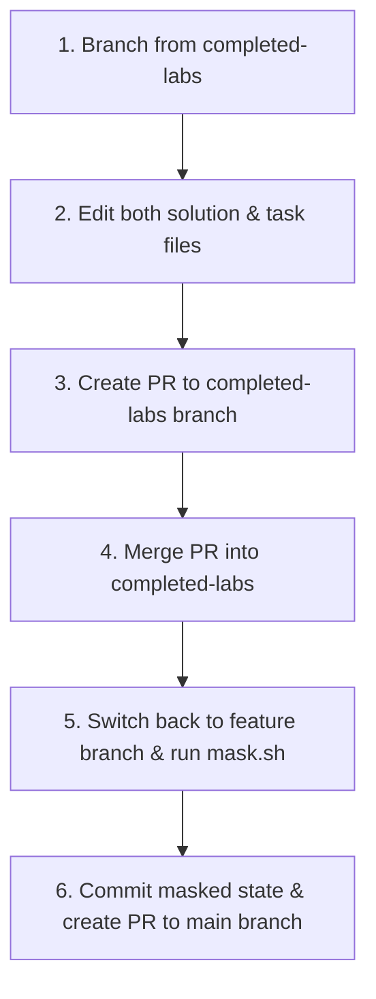

# ⚽ Agentic Football Workshop - Developer & Maintainer Guide

> [!NOTE]
> This document is intended strictly for developers, maintainers, and authors of the Agentic Football Workshop codebase. If you are a workshop participant, please follow the student-facing instructions in [INSTRUCTIONS.md](INSTRUCTIONS.md).

This repository contains the source code, Phaser engine assets, and Agent Development Kit (ADK) configurations for a 5v5 interactive LLM soccer simulator workshop. The codebase is divided into two primary sections: **LAB01** (asset generation and custom onboarding) and **LAB02** (the live multi-agent simulation).

---

## 🏗️ Project Architecture

The workspace is structured to separate concerns between frontend simulation layers and backend agent communication layers:

```
agent-football/
├── mask.sh                      # Root masking script to overwrite solution files with templates
├── LICENSE.md                   # Apache 2.0 license file
├── INSTRUCTIONS.md              # Workshop student activity instructions
├── ToDo.md                      # Release tracking tasklist
├── LAB01/                       # Onboarding & asset generation portal
│   ├── app.py                   # Solved FastAPI backend
│   ├── task_app.py              # Incomplete task template for students
│   ├── prompts.py               # Image generation prompts
│   ├── utils.py                 # Spritesheet compilation & base64 utilities
│   └── static/                  # Onboarding UI (HTML/Tailwind/JS)
└── LAB02/                       # Multi-agent 2D soccer simulation
    ├── README.md                # LAB02 overview
    ├── run_lab02.sh             # Consolidated runner script (Frontend + Captain + Coach)
    ├── football_agents/         # ADK agent configurations
    │   ├── agent.py             # Head Coach agent (solved)
    │   ├── task_agent.py        # Head Coach agent template
    │   ├── captain.py           # Team Captain agent (solved)
    │   ├── task_captain.py      # Team Captain agent template
    │   ├── captain_server.py    # Captain A2A server launcher (solved)
    │   ├── task_captain_server.py # Captain A2A server template
    │   ├── football_mcp_server.py # FastMCP server hosting condition tools
    │   └── specialist_agents/   # Specialist player agents
    │       ├── defender.py      # Defender Specialist (solved)
    │       ├── midfielder.py    # Midfielder Specialist (solved)
    │       ├── forward.py       # Forward Specialist (solved)
    │       ├── goalkeeper.py    # Goalkeeper Specialist (solved)
    │       └── tools.py         # Profile I/O, backup/restore, & dummy MCP tools
    └── frontend/                # Phaser 2D game engine client
        ├── vite.config.js       # Vite development proxy configuration
        ├── package.json         # Node.js dependencies
        └── src/
            ├── main.js          # Coach console UI, A2A/SSE handler, and MCP logger
            └── game.js          # Core Phaser game loop & player state synchronization
```

---

## 🛠️ Developer Environment Setup & Prerequisites

Maintainers must configure their local environments with Google Cloud credentials and authorized SDKs to test model calls.

### 1. Cloning the Repository
Clone the repository to your local workspace:
```bash
git clone https://github.com/salomonerobert/agent-football.git
cd agent-football
```

### 2. Enabling required Google Cloud APIs
Vertex AI model access requires enabling the Vertex AI service inside your Google Cloud project. 

Install the Google Cloud CLI (`gcloud`) and run:
```bash
# Authenticate your CLI session
gcloud auth login

# Set your active GCP project ID
gcloud config set project your-google-cloud-project-id

# Enable the Vertex AI API service
gcloud services enable aiplatform.googleapis.com
```

Ensure your IAM user or service account has the **Vertex AI User** (`roles/aiplatform.user`) role assigned in the Google Cloud Console.

### 3. Initialize the Virtual Environment
The repository packages a pre-configured Python virtual environment for developer convenience.
```bash
# Activate the python virtual environment
source venv/bin/activate

# Verify dependencies are correctly resolved
pip list
```

### 4. Configure Environment Variables
Copy the template `.env.example` to `.env` in the repository root:
```bash
cp .env.example .env
```
Open `.env` and fill in your authorized Google Cloud parameters:
```ini
GOOGLE_GENAI_USE_VERTEXAI=true
GOOGLE_CLOUD_PROJECT=your-google-cloud-project-id
GOOGLE_CLOUD_LOCATION=us-central1
```

---

## 📋 Standard Operating Procedure (SOP) for Code Changes

This repository operates on a strict **two-branch system** to separate the completed reference solutions from the blank task templates delivered to students.



### 1. Work off the `completed-labs` branch
Never make changes directly on the `main` branch. Always checkout a feature branch branching out from the solved reference branch:
```bash
git checkout completed-labs
git pull origin completed-labs
git checkout -b feature/my-feature-name
```

### 2. Modify both code versions in parallel
When adding a feature or fixing a bug, implement it in **both** files in the pair:
*   The completed file (e.g. `LAB02/football_agents/specialist_agents/defender.py`).
*   The student task template file (e.g. `LAB02/football_agents/specialist_agents/task_defender.py`), ensuring that the `# TODO` comment blocks and blank constants reflect your structural updates.

### 3. Submit Pull Request to `completed-labs`
Push your feature branch and create a Pull Request targeting the **`completed-labs`** branch. Once reviewed and accepted, merge the feature branch. This ensures that the master history of the solved workshop remains intact and up-to-date.

### 4. Apply Masking locally
Go back to your local feature branch, pull the latest updates, and run the master masking script from the root of the project:
```bash
bash mask.sh
```
This script will overwrite all completed solved files (`app.py`, `agent.py`, etc.) with their task template files (`task_app.py`, etc.) and delete the now-redundant task templates, leaving only the incomplete workspace for the students.

### 5. Submit Pull Request to `main`
Commit the masked changes to your feature branch, push it to remote, and open a second Pull Request targeting the **`main`** branch. Once merged, the student workspace is updated!

---

## 🧪 Testing and Verification

Before releasing code, maintainers should test the components locally to verify everything is working.

### Testing LAB01 (Avatar Creator)
1. Navigate to `LAB01` and run the FastAPI server:
   ```bash
   cd LAB01
   uvicorn app:app --host 127.0.0.1 --port 8002 --reload
   ```
2. Navigate to `http://127.0.0.1:8002` in your browser.
3. Generate spritesheets for blue and red teams. Verify they are correctly written to `LAB02/frontend/public/assets/sprites/`.
4. Modify sliders in **Step 2 (Tactical Tuning)**, click **"Save Player Profiles"** and verify that all 27+ attributes are written cleanly to `LAB02/frontend/public/player_state/*.json`.

### Testing LAB02 (Soccer Simulation)
Maintainers can run the services using the consolidated startup script or by starting each service manually in separate terminals.

#### Option A: Run using the Consolidated Script (Recommended)
1. Navigate to the `LAB02` directory:
   ```bash
   cd LAB02
   ```
2. Start all three services concurrently:
   *   **To run the completed reference solution**:
       ```bash
       bash run_lab02.sh
       ```
   *   **To run the student task templates**:
       ```bash
       bash run_lab02.sh task
       ```
3. Press `Ctrl+C` in the terminal to gracefully stop all services.

#### Option B: Run Manually in Separate Terminals
Start the following three commands in separate terminals:

1.  **Frontend Server**:
    ```bash
    cd LAB02/frontend
    npm run dev
    ```
    *Runs Vite on `http://localhost:5173/`.*

2.  **Captain A2A Server**:
    ```bash
    cd LAB02
    python3 -m football_agents.captain_server # (use .task_captain_server for templates)
    ```
    *Exposes the Captain remote agent on port 8001.*

3.  **Coach Server (ADK Web)**:
    ```bash
    cd LAB02
    ../venv/bin/adk web football_agents/agent.py # (use /task_agent.py for templates)
    ```
    *Runs the ADK Web proxy on port 8000.*

### E2E Verification Flow
Open `http://localhost:5173/` in your browser, click **Kick Off!**, and type shouts into the Coach Bar (e.g., "everyone attack"). Verify in the logs that the Coach delegates to the Captain, the Captain delegates to individual players, the players execute `update_profile` tool calls, and the final quotes are assembled into the huddle response.
