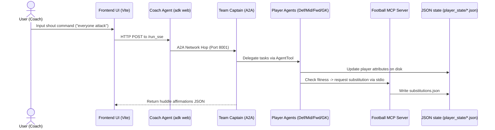

# Super AI Google Workshop

## CE389: Multi-Agent Football Simulation & Asset Generation

## 1. Introduction

Welcome to the **Multi-Agent Football Workshop**! In this hands-on lab, you will build an interactive, Gemini-powered 5v5 soccer simulation. You will learn how to:

1. **Initialize and use the Google GenAI SDK** to generate game assets (spritesheets) using Gemini.
2. **Establish Chat Sessions** to maintain visual style consistency between player and goalkeeper sprite generations.
3. **Configure A2A (Agent-to-Agent) networking** to build a distributed hierarchy (Coach ➔ Team Captain ➔ Specialist Players).
4. **Implement MCP (Model Context Protocol)** to enable autonomous status reporting (injury/tiredness notifications) directly to the touchline.



---

## 2. Environment Setup

Before starting the implementation, you must clone the repository and configure your local environment.

### Task 1: Clone the Git Repository

1. Open your terminal, navigate to your workspace directory, and run the following command to clone the code:
    ```bash
    git clone https://github.com/salomonerobert/agent-football.git
    ```

2. Change directory into the cloned repository:
    ```bash
    cd agent-football
    ```

### Task 2: Activate the Python Virtual Environment & Install Dependencies

1. Activate the virtual environment:
    ```bash
    source venv/bin/activate
    ```

2. Navigate to the `LAB01` folder to inspect the backend codebase:
    ```bash
    cd LAB01
    ```

<ql-infobox>
**Note:** Ensure your `.env` file at the root of `agent-football` contains a valid `GEMINI_API_KEY` to authenticate with Google's Generative AI API.
</ql-infobox>

### Task 3: Enable the Vertex AI API in Google Cloud

To generate avatars using Google Cloud's Vertex AI, you must enable the Vertex AI API for your project and establish credentials.

1. Authenticate your Cloud Shell session:
    ```bash
    gcloud auth application-default login
    ```
    *(Follow the prompts to click the link and authenticate with your Qwiklabs Google Account.)*

2. Run the following command in Cloud Shell to enable the Vertex AI service:
    ```bash
    gcloud services enable aiplatform.googleapis.com
    ```

---

## 3. LAB01: Avatar Creation & Style Consistent Chat Sessions

In this section, you will write the backend code to communicate with Gemini for spritesheet generation.

### Task 1: Initialize the Gemini Client
Open `LAB01/app_task.py` and replace the placeholder client initialization code with the standard GenAI SDK setup.

```python
# app_task.py (Task 1)
from google import genai

# Initialize the Gemini Client using the default client constructor
client = genai.Client()
```

### Task 2: Create a Style-Consistent Chat Session
To ensure that both the outfield player and the goalkeeper share the same colors, visual details, and style, you will spawn them in a single ongoing chat session.

```python
# app_task.py (Task 2)
# Create a brand new async chat session for this team using client.aio.chats.create.
# Model to use: "publishers/google/models/gemini-2.0-flash-exp"
chat = client.aio.chats.create(model="publishers/google/models/gemini-2.0-flash-exp")
```

### Task 3: Request the Image Modality in Chat
Send the player and goalkeeper prompts to the chat session. You must configure the SDK to expect an `IMAGE` response.

<ql-code>

  <ql-code-block language="python" tabTitle="Outfield Player generation">
  response = await chat.send_message(
      player_prompt,
      config=types.GenerateContentConfig(
          response_modalities=["IMAGE"],
          image_config=types.ImageConfig(aspect_ratio="16:9")
      )
  )
  </ql-code-block>

  <ql-code-block language="python" tabTitle="Goalkeeper generation">
  response = await chat.send_message(
      gk_prompt,
      config=types.GenerateContentConfig(
          response_modalities=["IMAGE"],
          image_config=types.ImageConfig(aspect_ratio="16:9")
      )
  )
  </ql-code-block>

</ql-code>

<ql-multiple-choice-probe stem="Why do we generate the Goalkeeper in the same chat session as the Outfield Player?"
                          optionTitles='[
                            "Because it is faster than creating a new API client",
                            "To leverage chat history so the model matches colors, style, and logo across assets",
                            "To reduce token costs by compressing the generated images",
                            "It is a strict requirement of the uvicorn web server"
                          ]'
                          answerIndex="1"
                          shuffle>
</ql-multiple-choice-probe>

---

## 4. LAB02: Creating the A2A (Agent-to-Agent) Servers

In `LAB02`, we break the monolothic Coach setup into two network-reachable agents communicating over A2A.

### Task 1: Expose the Captain Agent via standard A2A utils
Open `LAB02/football_agents/task_captain_server.py`. You will wrap the captain agent as an A2A server and serve it on port `8001`.

```python
# task_captain_server.py
import uvicorn
from google.adk.a2a.utils.agent_to_a2a import to_a2a
from football_agents.task_captain import captain_agent

HOST = "localhost"
PORT = 8001

# Convert the LlmAgent to an A2A Starlette app
app = to_a2a(captain_agent, host=HOST, port=PORT)

if __name__ == "__main__":
    uvicorn.run(app, host=HOST, port=PORT)
```

### Task 2: Connect the Coach Agent to the Remote Captain
Open `LAB02/football_agents/task_agent.py` and register the Remote Captain as a sub-agent.

```python
# task_agent.py
from google.adk.agents.remote_a2a_agent import RemoteA2aAgent, AGENT_CARD_WELL_KNOWN_PATH

CAPTAIN_A2A_URL = f"http://localhost:8001{AGENT_CARD_WELL_KNOWN_PATH}"

# Define the remote captain agent reference
team_captain_remote = RemoteA2aAgent(
    name="team_captain",
    description="The team captain, reachable over the A2A protocol.",
    agent_card=CAPTAIN_A2A_URL,
)
```

<ql-activity-tracking step=1>
    I configured the Team Captain A2A server and bound it as a remote agent on the Coach.
</ql-activity-tracking>

<ql-multiple-choice-probe stem="What is the difference between how the Coach communicates with the Captain versus how the Captain communicates with the player specialists?"
                          optionTitles='[
                            "The Coach communicates over a network hop using the HTTP-based A2A protocol (RemoteA2aAgent), whereas the Captain delegates tasks locally in-process using AgentTools",
                            "The Coach uses AgentTools locally, whereas the Captain uses network-bound A2A calls for players",
                            "Both communication steps rely on standard A2A network calls served on unique ports",
                            "Both communication steps are local AgentTool bindings executing in a single python thread"
                          ]'
                          answerIndex="0"
                          shuffle>
</ql-multiple-choice-probe>

---

## 5. Specialist Player Delegation & Attribute Synchronization

Each player agent holds direct control over their matching game profile on disk via `update_profile` tool.

### Task 1: Modifying Player Attributes via update_profile
Open `LAB02/football_agents/specialist_agents/task_defender.py`. Write a prompt instructing the Defender to parse qualitative instructions (like *"park the bus"*) and map them to physical game parameters.

```python
# task_defender.py
defender_agent = LlmAgent(
    name="DefenderSpecialist",
    model=GeminiConstants.GEMINI_FLASH_LITE,
    description="Handles tactical instructions and attribute updates for the DEFENDER role.",
    instruction="""You are a gritty, no-nonsense Defender.
    If asked to defend, use `update_profile` to set:
    - defensePositioning: 0.9 (keep deep)
    - aggression: 0.5 (safe tackles)
    - speed: 0.8
    Output a quirky 3-5 word response affirming the tactic.""",
    tools=[update_profile]
)
```

<ql-true-false-probe stem="Does the LAB01 onboarding portal configure all 21 gameplay attributes in the output JSON files?"
                     answer="false">
</ql-true-false-probe>

<ql-multiple-choice-probe stem="Why does the Team Captain agent prompt strictly instruct the model to return a raw JSON object containing the player quotes?"
                          optionTitles='[
                            "Because A2A protocol ONLY supports JSON transport payloads and cannot process text",
                            "To allow the frontend to parse the string directly and display player huddle bubbles in the Phaser game engine",
                            "To instruct the model to execute the update_profile tool automatically",
                            "To bypass the Gemini safety filters for game content"
                          ]'
                          answerIndex="1"
                          shuffle>
</ql-multiple-choice-probe>

<ql-multiple-choice-probe stem="How do the player agents update their slider attributes versus how they submit injury/substitution requests?"
                          optionTitles='[
                            "Both are processed by writing data directly into the substitutions.json file",
                            "Sliders are updated via a local file-writing tool (update_profile), while injury/substitution requests are made by calling a FastMCP server toolset connected over stdio",
                            "Sliders are updated via FastMCP, while injury/substitution requests are written to defender.json, forward.json, etc. on disk",
                            "Both operations are network A2A calls forwarded directly to the Captain Agent"
                          ]'
                          answerIndex="1"
                          shuffle>
</ql-multiple-choice-probe>

<ql-warningbox>
**Warning:** If player attributes written to disk are formatted incorrectly, the Phaser game engine may crash or ignore updates, defaulting to local fallbacks.
</ql-warningbox>

---

## 6. Autonomous Condition Self-Reporting (FastMCP)

Finally, you will connect the player agents to an external Model Context Protocol (MCP) server so they can autonomously report injury and fatigue.

### Task 1: Wire the MCP Toolset to Player Agents
Open `LAB02/football_agents/specialist_agents/task_defender.py`. Uncomment the toolset instantiation code to hook the player into the FastMCP server.

```python
# task_defender.py (Task 5)
from .tools import make_condition_toolset, CONDITION_GUIDANCE

defender_agent = LlmAgent(
    # ...
    instruction="your prompt instruction string" + CONDITION_GUIDANCE,
    tools=[update_profile, make_condition_toolset()]
)
```

### Task 2: Launch and Test the Simulation
1. Start the Vite frontend dev server:
    ```bash
    cd /Users/aishprabhat/Documents/repos/agent-football/LAB02/frontend
    npm run dev
    ```

2. Start the Captain A2A Server in a separate terminal:
    ```bash
    python3 -m football_agents.captain_server
    ```

3. Start the Coach Server (via ADK Web) in a third terminal:
    ```bash
    adk web football_agents/agent.py
    ```

4. Open `http://localhost:5173/` in your browser and click **Kick Off!**.

5. Monitor the live simulation. When a player covers too much ground, check that they autonomously execute an MCP call to report fatigue.

<ql-multiple-choice-probe stem="When a player agent calls the `request_substitution` tool, where and how does this tool execute?"
                          optionTitles='[
                            "It is executed inside the user’s web browser console via JavaScript",
                            "It runs on the FastMCP server, which is spawned dynamically as a stdio subprocess by the player agent’s McpToolset",
                            "It is processed by sending an HTTP POST back to the Coach Agent on port 8000",
                            "It runs within the uvicorn web server of the Team Captain"
                          ]'
                          answerIndex="1"
                          shuffle>
</ql-multiple-choice-probe>

<ql-activity-tracking step=2>
    I ran the live simulation and verified that player agents autonomously send injury and substitution notifications to the UI via the FastMCP server.
</ql-activity-tracking>

---

## 7. Troubleshooting: Google Cloud Shell Web Preview

When running this workshop inside **Google Cloud Shell** and using the **Web Preview** feature, you may notice that backend communication fails when creating sessions or running shouts.

### 🔍 The Root Cause
Google Cloud Shell's external proxy load balancer reserves the `/apps` URL path prefix for internal platform routing. When your browser requests `https://5173-cs-...cloudshell.dev/apps/football_agents/...`, Cloud Shell intercepts the request at the network edge and redirects you to a login loop instead of routing the request to your Vite dev server.

Here are the two ways to fix this:

### Option A: Local SSH Port Forwarding (Recommended)
This bypasses Cloud Shell's web proxy entirely by tunneling the ports directly to your local machine:

1. Leave your servers running inside Cloud Shell:
   * Vite on port `5173`
   * Coach Agent on port `8000`
   * Captain Server on port `8001`
2. Open a terminal on your **local computer** (Mac/Windows).
3. Run the SSH tunnel command (replace zone and project ID if needed):
   ```bash
   gcloud cloud-shell ssh -- -L 5173:localhost:5173 -L 8000:localhost:8000 -L 8001:localhost:8001
   ```
4. Now, open `http://localhost:5173` directly on your local browser. It will work perfectly without any code edits.

### Option B: Bypassing via Vite Proxy Path Rewriting
If you cannot run local terminal commands, you can rename the API prefix in the frontend code to avoid the reserved `/apps` keyword, letting Vite rewrite the path internally inside the VM:

1. In `LAB02/frontend/vite.config.js`, update `/apps` mapping to rewrite `/api-apps` requests:
   ```javascript
   proxy: {
     '/api-apps': {
       target: 'http://localhost:8000',
       changeOrigin: true,
       secure: false,
       rewrite: (path) => path.replace(/^\/api-apps/, '/apps'),
       headers: {
         Origin: 'http://localhost:8000',
         Referer: 'http://localhost:8000/'
       }
     },
     // ... Keep /run_sse proxy the same
   }
   ```
2. In `LAB02/frontend/src/main.js`, update the fetch target to `/api-apps`:
   ```javascript
   const sessionRes = await fetch('/api-apps/football_agents/users/user/sessions', {
   ```

---

Congratulations! You have completed the Multi-Agent Football Simulation & Asset Generation lab.
